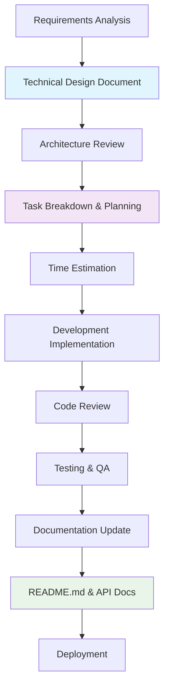
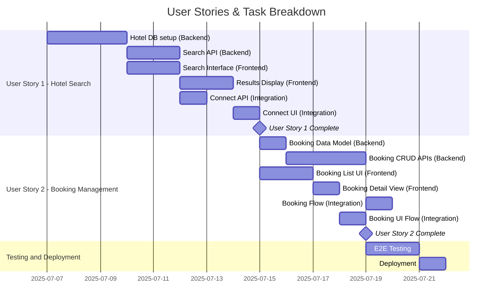

# Feature Development Process Guide

[](https://github.com/wokim/feature-dev-guide)
[](https://github.com/wokim/feature-dev-guide)

---

## 🚀 Quick Start - Example Files

| Phase | Example Directory | What You'll Find |
|-------|------------------|------------------|
| **Phase 1: Technical Design** | [`technical-design-docs/`](./technical-design-docs/) | Complete design documents, system architecture examples |
| **Phase 2: Task Breakdown** | See examples in Phase 2 section | User stories, task planning templates, Gantt charts |
| **Phase 3: Implementation** | [`readme-examples/`](./readme-examples/) | Real README.md files, living documentation examples |

**💡 Start Here**: Browse the example directories above to see the process in action before reading the detailed guide below.

---

## Table of Contents

- [Overview](#overview)
- [Development Process Flow](#development-process-flow)
- [Phase 1: Technical Design Document](#phase-1-technical-design-document)
- [Phase 2: User Stories & Task Breakdown](#phase-2-user-stories--task-breakdown)
- [Phase 3: Implementation Documentation](#phase-3-implementation-documentation)

---

## Overview

This repository demonstrates a comprehensive feature development process that ensures proper documentation, planning, and implementation. The process consists of three main phases: **Technical Design**, **Task Breakdown**, and **Implementation Documentation**.

### Why This Process?

| Benefit | Description |
|---------|-------------|
| **Structured Approach** | Clear steps from requirements to deployment |
| **Living Documentation** | Documentation that evolves with code |
| **Team Alignment** | Common understanding across all stakeholders |
| **Quality Assurance** | Built-in review and validation checkpoints |

---

## Development Process Flow



---

## Phase 1: Technical Design Document

### Purpose
Define **what** to build based on requirements analysis, providing a comprehensive blueprint for development.

### Key Components

| Component | Description | Output |
|-----------|-------------|---------|
| **Requirements & Goals** | Functional and non-functional requirements | Clear scope definition |
| **Terminology** | Key terms and definitions | Shared vocabulary |
| **Capacity Estimation** | Traffic, storage, bandwidth, memory estimates | Concrete numbers for scaling |
| **System APIs** | Interface definitions and contracts | API specifications |
| **Database Design** | Schema and data modeling | Data architecture |
| **System Design & Algorithm** | Core logic and implementation approach | Technical approach |
| **High-Level Architecture** | Component interactions and data flow | System overview |

### Document Structure

| Step | Focus | Key Deliverables |
|------|-------|------------------|
| **1. Requirements Clarification** | Functional Requirements (what the system should do)<br>Non-Functional Requirements (scale, performance, reliability)<br>Scope Definition (what's in/out of scope) | Requirements document |
| **2. System Interface Definition** | API specifications with key parameters<br>Response formats and error handling<br>Integration points with external systems | API contract |
| **3. Back-of-the-envelope Estimation** | Traffic estimates (QPS, concurrent users)<br>Storage estimates (data size, growth rate)<br>Bandwidth estimates (network usage)<br>Memory estimates (caching requirements) | Capacity planning |
| **4. Data Model Design** | Entity definitions and relationships<br>Database choice rationale (SQL vs NoSQL)<br>Storage considerations (block storage, file systems) | Data architecture |
| **5. High-Level System Design** | Core component architecture (5-6 main components)<br>Component interactions and data flow<br>End-to-end request flow | System architecture |
| **6. Detailed Design** | Deep dive into critical components<br>Alternative approaches with pros/cons<br>Scalability considerations (partitioning, caching) | Implementation details |
| **7. Bottlenecks and Trade-offs** | Single points of failure identification<br>Performance bottlenecks and mitigation<br>Monitoring and alerting strategy | Risk mitigation |

### Document Management
**Recommended Tools**: Use collaborative documentation platforms for Technical Design documents:
- **Confluence**: Enterprise-grade collaboration with advanced formatting and integration
- **Notion**: Flexible workspace with database capabilities and modern editing experience
- **Similar platforms**: Any tool that provides real-time collaboration and rich formatting

**Why not GitLab/Markdown for this phase?**
- Technical Design requires extensive collaboration across teams (PM, Engineering, Design)
- Rich formatting needed for complex diagrams, tables, and annotations
- Easy access for non-technical stakeholders
- Better commenting and review workflows
- Future integration possibilities with LLM tools (MCP, etc.)

### Example Documents
📁 **See [`technical-design-docs/`](./technical-design-docs/) directory for detailed examples:**
- Complete technical design documents in PDF format
- Real-world examples covering different system types
- Templates and best practices from actual projects

---

## Phase 2: User Stories & Task Breakdown

> User stories often come from the business side — through proposals or product planning

### Purpose
Transform technical design into user-centered goals (User Stories) and actionable development tasks, bridging the gap between business requirements and implementation.

### Two-Layer Approach

| Layer | Purpose | Audience | Language | Format |
|-------|---------|----------|----------|---------|
| **User Stories** | Define user value and business outcomes | All stakeholders | Plain language | "User can [action] to achieve [outcome]" |
| **Tasks** | Specific implementation work | Development teams | Technical terminology | 1-3 day work chunks with acceptance criteria |

#### 1. User Stories
**Purpose**: Define **what users can achieve** and **why it matters** from a business perspective.

| Characteristic | Description | Example |
|----------------|-------------|---------|
| **Language** | Plain language accessible to all stakeholders | "User can search hotels by location" |
| **Focus** | User value and business outcomes | Booking efficiency, user satisfaction |
| **Format Options** | "As a [user type], I want [goal] so that [benefit]"<br>Or simplified: "User can [action] to achieve [outcome]" | "As a traveler, I want to filter hotels by price so that I can find affordable options" |
| **Scope** | High-level functionality that delivers value | Complete user workflow |

#### 2. Tasks
**Purpose**: Break down user stories into **specific implementation work** required by different teams.

| Characteristic | Description | Example |
|----------------|-------------|---------|
| **Scope** | 1-3 day work chunks | "Implement hotel search API endpoint" |
| **Teams** | Backend, Frontend, DevOps, QA, etc. | Backend: API development, Frontend: UI components |
| **Language** | Technical terminology acceptable | "Configure Redis caching layer", "Implement JWT authentication" |
| **Dependencies** | Clear prerequisite relationships | Task B starts after Task A completion |
| **Completion** | Specific acceptance criteria | "API returns filtered results in <200ms" |
| **Estimation** | Realistic time assessment | 2 days for experienced developer |

### Planning Structure


### Example Structure

#### User Stories Examples

| Story ID | User Story | Business Value |
|----------|------------|----------------|
| **US-1** | User can search for hotels by location, dates, and guest count to find available accommodations | Enable core booking functionality |
| **US-2** | User can view and manage their hotel reservations to track their travel plans | Improve user experience and reduce support calls |

#### Task Breakdown Examples

**User Story 1: Hotel Search**

| Team | Task | Description | Duration | Dependencies |
|------|------|-------------|----------|--------------|
| **Backend** | Build hotel database | Use Go Global Travel template to set up hotel data structure | 3 days | None |
| **Backend** | Implement search API | Create API endpoint with filtering by location, dates, guest count | 2 days | Hotel database |
| **Backend** | Add caching layer | Implement Redis caching for search performance | 1 day | Search API |
| **Frontend** | Create search interface | Build hotel search form with location and date pickers | 2 days | API specification |
| **Frontend** | Implement results display | Show search results with hotel cards, pagination | 2 days | Search interface |
| **Frontend** | Add search filters | Price range, amenities, star rating filters | 1 day | Results display |
| **Integration** | Connect frontend with API | Wire up search form to backend API | 1 day | Search API, Results display |

**User Story 2: Booking Management**

| Team | Task | Description | Duration | Dependencies |
|------|------|-------------|----------|--------------|
| **Backend** | Design booking data model | Define booking entity, relationships, validation rules | 1 day | Hotel database |
| **Backend** | Implement booking CRUD APIs | Create, read, update, delete booking operations | 3 days | Booking data model |
| **Backend** | Add booking validation | Check availability, payment validation, business rules | 1 day | Booking CRUD APIs |
| **Frontend** | Create booking list interface | Display user's bookings with status and details | 2 days | Booking APIs |
| **Frontend** | Add booking detail view | Detailed booking information, modification options | 1 day | Booking list interface |
| **Integration** | End-to-end booking flow | Complete booking process from search to confirmation | 2 days | All booking components |

#### Task Summary by Team

| Team | Total Tasks | Total Duration | Key Responsibilities |
|------|-------------|----------------|---------------------|
| **Backend** | 6 tasks | 11 days | Data models, APIs, business logic, caching |
| **Frontend** | 5 tasks | 8 days | User interfaces, forms, data display |
| **Integration** | 2 tasks | 3 days | Connecting frontend and backend, E2E flows |
| **Total** | 13 tasks | ~15 days* | *Accounting for parallel work |


## Phase 3: Implementation Documentation

### Purpose
Document the **implemented** system for future maintenance, onboarding, and knowledge transfer.

### Key Components

| Component | Purpose | Location |
|-----------|---------|----------|
| **System Overview** | What the service does and key features | README.md |
| **Architecture Diagrams** | Visual system design with Mermaid | README.md or docs/ |
| **API Reference** | Essential endpoints (high-level) | README.md + Swagger |
| **Infrastructure** | Deployment architecture | README.md or docs/ |
| **Data Models** | Core database/storage schemas | README.md |
| **Setup & Development** | How to run, test, deploy locally | README.md |

### Documentation Hierarchy
```
📁 Project Root
├── 📄 README.md (Complete system documentation)
├── 📁 docs/ (optional for complex systems)
│   └── 📄 api-detailed.md (if Swagger isn't enough)
└── 📄 CHANGELOG.md
```

### Living Documentation Philosophy

> **Why Repository-Based Documentation?**

**Technical Design vs Implementation Docs**
- **Technical Design**: Initial blueprint and architectural decisions (static after approval)
- **Implementation Docs**: Current reality of the codebase (evolves with every change)

**The Documentation Lifecycle Problem**
- After initial implementation, continuous bug fixes and improvements occur
- Expecting Technical Design documents to stay updated with every code change is unrealistic
- **Result**: Technical Design becomes outdated and unreliable

**Solution - Code-Coupled Documentation**
- **README.md**: Lives with code, updated with significant changes
- **API Documentation**: Auto-generated from code (Swagger/OpenAPI)
- **Architecture Diagrams**: Maintained in repository alongside implementation
- **Code Comments**: Document complex business logic and architectural decisions

**Document Usage Strategy**
| Scenario | Use This Documentation |
|----------|----------------------|
| New projects/major features | Technical Design documents |
| Current system understanding | Implementation Documentation |
| API integration | Auto-generated API docs |
| Troubleshooting | README and inline code documentation |

> 💡 **Key Insight**: This approach ensures documentation accuracy by tying it directly to the codebase lifecycle.

### Example Documents
📁 **See [`readme-examples/`](./readme-examples/) directory for detailed examples:**
- Complete README.md files from real projects
- Different system types and complexity levels
- Best practices for living documentation
- Templates for various project categories

*These examples demonstrate how to create comprehensive, maintainable documentation that evolves with your codebase.*

---

*This process ensures comprehensive documentation throughout the development lifecycle, from initial design to final implementation, facilitating better communication, planning, and long-term maintainability.*
