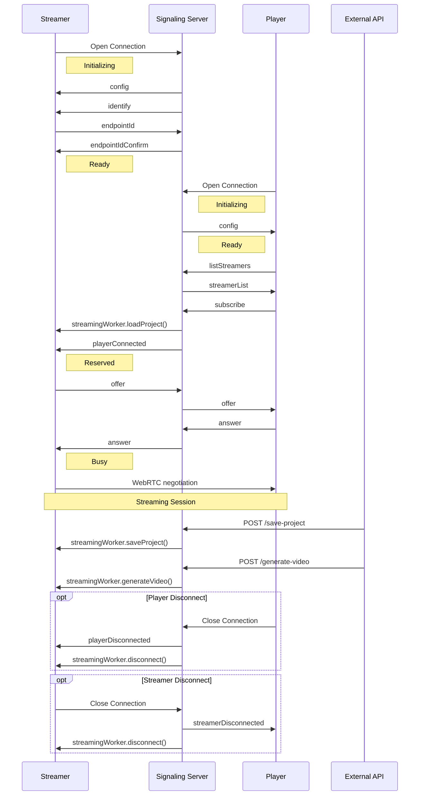
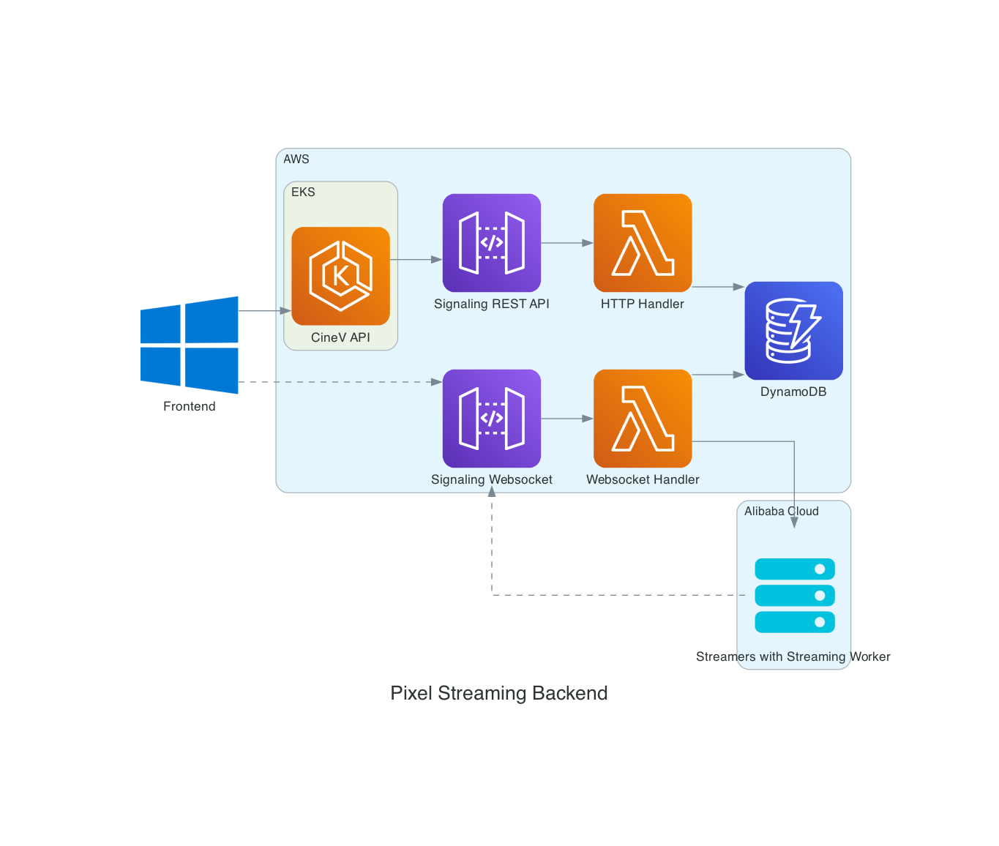
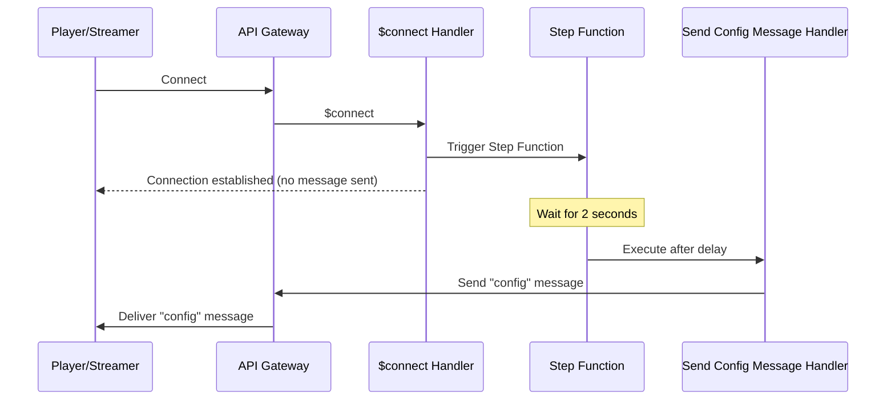
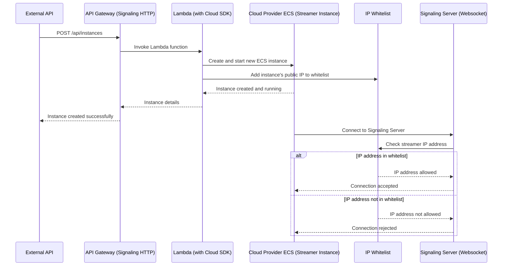
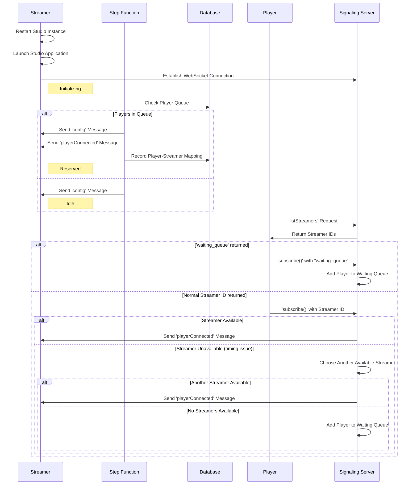
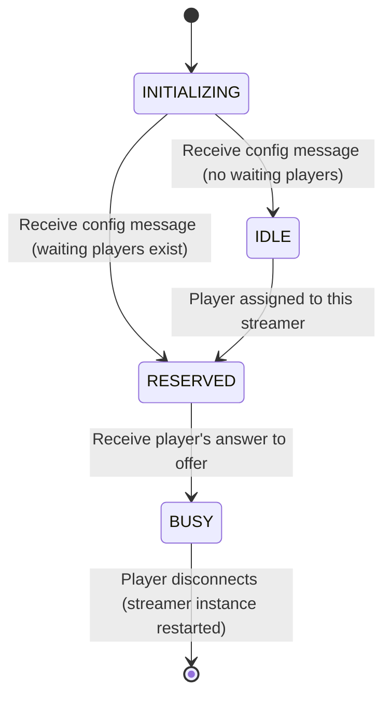

# Pixel Streaming Backend

[]()
[]()
[](https://github.com/prettier/prettier)

pixel-streaming-backend is a scalable and flexible signaling server compatible with Unreal Engine's pixel streaming technology, built on a serverless architecture using AWS API Gateway WebSockets and Lambda.

## Table of Contents

- [Introduction](#introduction)
- [Signaling Server Workflow](#signaling-server-workflow)
- [API Reference](#api-reference)
- [Infrastructure](#infrastructure)
- [Data Modeling](#data-modeling)
- [Delayed Delivery of "config" Message](#delayed-delivery-of-config-message-using-step-functions-in-a-websocket-connection-establishment-flow)
- [Streamer WebSocket Security](#streamer-websocket-security)
  - [Signaling HTTP Endpoints](#signaling-http-endpoints)
  - [Streamer WebSocket Security Flow](#streamer-websocket-security-flow)
- [Player Queuing System](#player-queuing-system)
- [Streamer State](#streamer-state)
- [Getting Started](#getting-started)
  - [Prerequisites](#prerequisites)
  - [Installing](#installing)
  - [Local Development](#local-development)
  - [Deployment](#deployment)
  - [Testing](#testing)

## Introduction

Pixel Streaming Backend is a robust, scalable signaling server designed to work seamlessly with Unreal Engine's pixel streaming technology. Built on a serverless architecture using AWS API Gateway WebSockets and Lambda, this solution offers high performance and flexibility for managing pixel streaming sessions.

Key features include:

- Efficient player-streamer matching and session management
- Scalable infrastructure using AWS serverless technologies
- Secure streamer connections with IP whitelisting
- Intelligent player queuing system for high-demand scenarios
- Integration with Cloud Provider ECS for hosting streaming workers
- RESTful API for managing streaming instances

Whether you're building a cloud gaming platform, a virtual production environment, or any application requiring high-quality, low-latency streaming of 3D content, Pixel Streaming Backend provides the necessary infrastructure to handle your signaling needs efficiently.

## Signaling Server Workflow



## API Reference

The Pixel Streaming Backend provides both WebSocket and HTTP REST APIs. Here's an overview of the main endpoints:

### WebSocket API

The WebSocket API is used for real-time communication between players, streamers, and the signaling server.

| Message Type      | Direction          | Description                                         |
| ----------------- | ------------------ | --------------------------------------------------- |
| config            | Server to Client   | Sends configuration data to newly connected clients |
| identify          | Server to Streamer | Requests the streamer to identify itself            |
| endpointId        | Streamer to Server | Streamer's response to the identify request         |
| endpointIdConfirm | Server to Streamer | Confirms the streamer's endpointId                  |
| listStreamers     | Player to Server   | Requests a list of available streamers              |
| streamerList      | Server to Player   | Sends the list of available streamers               |
| subscribe         | Player to Server   | Player subscribes to a specific streamer            |
| playerConnected   | Server to Streamer | Notifies streamer that a player has connected       |
| offer             | Streamer to Server | WebRTC offer from streamer                          |
| answer            | Player to Server   | WebRTC answer from player                           |
| iceCandidate      | Client to Server   | ICE candidate for WebRTC connection                 |

### HTTP REST API

The HTTP REST API is used for managing streaming instances and other administrative tasks.

| Endpoint                    | Method | Description                                       |
| --------------------------- | ------ | ------------------------------------------------- |
| /api/instances              | POST   | Create a new ECS instance for streaming           |
| /api/instances/{instanceId} | DELETE | Delete a specific ECS instance                    |
| /api/save-project           | POST   | Trigger a project save on a streaming instance    |
| /api/generate-video         | POST   | Initiate video generation on a streaming instance |

For detailed information on request and response formats, please refer to the API documentation available at the `/docs` endpoint when running the server.

### WebSocket Connection Parameters

When establishing a WebSocket connection, the following query parameters are used:

| Parameter  | Description                                                                                                                   | Required          | Default    |
| ---------- | ----------------------------------------------------------------------------------------------------------------------------- | ----------------- | ---------- |
| type       | Specifies the client type. Can be either 'player' or 'streamer'.                                                              | No                | 'streamer' |
| token      | Authentication token issued by auth-service. The userId field from the token payload is used as the playerId.                | Yes (for players) | N/A        |
| projectUrl | URL-encoded path to the project file to be loaded by the streamer when a player connects for cloud streaming of Studio App.  | Yes (for players) | N/A        |

Example player connection URL:

```
wss://your-api-gateway-url?type=player&token=your-auth-token&projectUrl=https%3A%2F%2Fexample-bucket.region.provider.com%2Fcompany%2Fdev%2Fproject%2F00069c00-1591-4c74-a6cf-5eb96645220d.project
```

Note: The projectUrl must be `URL-encoded` to ensure proper transmission of the full URL as a query parameter.

## Infrastructure


The infrastructure for the project consists of the following components:

| Component         | Description                                                                                                                                                                                                                                                                                                                                                                                                                                                                                                                                                                                                                                                                                                                                                                                         |
| ----------------- | --------------------------------------------------------------------------------------------------------------------------------------------------------------------------------------------------------------------------------------------------------------------------------------------------------------------------------------------------------------------------------------------------------------------------------------------------------------------------------------------------------------------------------------------------------------------------------------------------------------------------------------------------------------------------------------------------------------------------------------------------------------------------------------------------- |
| API Gateways      | - API Gateway WebSocket for signaling (both player and streamer connections)<br>- API Gateway (REST) for signaling HTTP endpoints                                                                                                                                                                                                                                                                                                                                                                                                                                                                                                                                                                                                                                                                   |
| Lambda Handlers   | - WebSocket API Gateway has lambda handlers for `$connect`, `$disconnect`, and `message` processing for both players and streamers.<br>- The HTTP API Gateway has lambda handlers to process REST endpoints. These handlers:<br> • Use the Cloud Provider SDK to manage ECS instances (create, delete, start, reboot, query)<br> • Handle project save and video generation requests from external-api and forward them to streaming workers                                                                                                                                                                                                                                                                                                                                                    |
| DynamoDB          | Used as the primary storage system for player and streamer data.                                                                                                                                                                                                                                                                                                                                                                                                                                                                                                                                                                                                                                                                                                                                    |
| Step Functions    | - During the `$connect` handler for players and streamers, after the connection is established, a message of type `config` needs to be sent to each player and streamer. However, at the time the `$connect` handler is invoked, the WebSocket connection in API Gateway is not yet fully established.<br>- In the `$connect` handler for players and streamers, a Step Function is triggered.<br>- This Step Function is configured to wait for 2 seconds before executing, allowing time for the WebSocket connection to fully establish.<br>- After the delay, the Step Function sends the `config` message to the respective player or streamer through the WebSocket connection.<br>- This approach ensures that the `config` message is sent only after the connection is likely to be ready. |
| Cloud Provider ECS | Hosts the streaming workers that handle the actual pixel streaming tasks.                                                                                                                                                                                                                                                                                                                                                                                                                                                                                                                                                                                                                                                                                                                          |
| External API       | Interacts with the signaling HTTP API Gateway to initiate operations like project saves and video generation requests.                                                                                                                                                                                                                                                                                                                                                                                                                                                                                                                                                                                                                                                                             |

## Data Modeling

DynamoDB is used as the storage system, and the data schemas can be found in the [`src/models`](src/models) directory.

| Table name            | Description                                                                                                                                                                                                                                                                                                                |
| --------------------- | -------------------------------------------------------------------------------------------------------------------------------------------------------------------------------------------------------------------------------------------------------------------------------------------------------------------------- |
| playerQueue           | The playerQueue table stores players who are waiting in the queue in order. Since the number of items in this table is not large, the hash key is intentionally set to a fixed string value `QUEUE` to create hot partitioning. The range key is set to timestamp to sort players within a single partition based on time. |
| playerStreamerMapping | The playerStreamerMapping table contains information about players and streamers who establish WebRTC sessions by exchanging subscribe/playerConnected messages. A streamer and a player are connected in a 1:1 relationship (the player exclusively uses the streamer).                                                   |
| streamers             | The streamers table contains information such as the streamer's ID, IP address, ECS instance name, API Gateway connection ID, and status.                                                                                                                                                                                  |
| players               | The players table stores information about connected players, including their ID, connection ID, and any relevant player-specific data.                                                                                                                                                                                    |
| ip-whitelist          | The ip-whitelist table contains a list of IP addresses that are allowed to connect as streamers. This table is used for the IP whitelist security feature to control access to streamer connections.                                                                                                                       |

## Delayed Delivery of "config" Message using Step Functions in a WebSocket Connection Establishment Flow



- When a player or streamer connects to the signaling server and establishes a WebSocket connection, the signaling server needs to send a message of type `config` containing information about the STUN and TURN servers to the player or streamer.
- However, at the time when the `$connect` handler in AWS API Gateway is invoked, the WebSocket connection might not be fully established. This means that messages cannot be reliably sent to the streamer or player at this point.
- To address this, the `$connect` handler triggers a Step Function. This Step Function is configured to wait for 2 seconds before executing.
- After the 2-second delay, the Step Function executes a Lambda function (WebSocket Handler) that sends the `config` message to the respective WebSocket connection.
- This approach ensures that the `config` message is sent only after the WebSocket connection is likely to be fully established, improving the reliability of the initial configuration process.

## Streamer WebSocket Security

### Signaling HTTP Endpoints

The Signaling HTTP endpoints are built using AWS API Gateway and Lambda functions. It provides the following functionalities:

| API                                | Description                                                                      |
| ---------------------------------- | -------------------------------------------------------------------------------- |
| POST /api/instances                | This endpoint uses the Cloud Provider SDK to create new ECS instances on the cloud. |
| DELETE /api/instances/{instanceId} | This endpoint deletes the specified ECS instance using the Cloud Provider SDK.      |
| GET /docs                          | Swagger Docs                                                                     |

### Streamer WebSocket Security Flow



The streamer WebSocket security is implemented using an IP whitelist. The security logic is as follows:

- When a streamer connects to the WebSocket, the streamer's IP address is checked against the IP whitelist.
- If the streamer's IP address is not present in the whitelist, the connection is rejected.
- If the streamer's IP address is found in the whitelist, the connection is allowed, and the streamer can proceed with the WebSocket connection.

#### Disabling IP Whitelist

The IP whitelist feature can be toggled on or off using an environment variable:

- `DISABLE_IP_WHITELIST`: When set to `true`, the IP whitelist check is disabled, allowing connections from any IP address. When set to `false` or not set, the IP whitelist check is active.

This environment variable provides flexibility in different deployment scenarios, allowing administrators to easily enable or disable the IP whitelist security feature as needed.

## Player Queuing System



- When a streamer is done with a session, it is restarted, which automatically disconnects the WebSocket connection, and the streamer is removed from the streamers table.
- During the restart process, the Studio Application is automatically launched on the streamer's Cloud Provider ECS instance by `Streaming Worker`, and a new WebSocket connection is established.
- In the Step Function handler, which sends delayed `config` messages to the connected streamers, the player queue is checked. If there are players waiting in the queue, the oldest player is selected, and a `playerConnected` message is sent to the streamer. The mapping information between the player and the streamer is then recorded in the database.
- When a player makes a `listStreamers` request, they receive a response containing a list of streamer IDs. If the array contains only one fixed streamer ID value called `waiting_queue`, the player determines that they have entered the waiting queue. Subsequently, when the player sends a `subscribe()` message to the signaling server, they include `waiting_queue` as the streamer ID. The signaling server then adds the player to the waiting queue.
- If, due to timing issues, the selected streamer becomes unavailable during the player's subscription process, the signaling server will choose another available streamer. If no streamers are available, the player is added to the waiting queue.
- Players in the waiting queue will be assigned one by one as streamers are restarted, initialized, and establish new WebSocket connections.

## Streamer State



- When a streamer establishes a WebSocket connection in the `$connect` handler, the streamer is stored with the `INITIALIZING` state.
- When the streamer receives the `config` message, it transitions to the `IDLE` state if there are no waiting players. If there are players waiting in the queue, it transitions directly to the `RESERVED` state.
- The `listStreamers` response includes streamers in the `IDLE` state and a special `"waiting_queue"` option if no `IDLE` streamers are available.
- If a player receives actual streamer IDs from `listStreamers`, they can subscribe to one of these streamers. The chosen streamer then transitions from `IDLE` to `RESERVED`.
- If a player receives the `"waiting_queue"` option from `listStreamers`, they subscribe to the `"waiting_queue"`. In this case, the signaling server doesn't immediately send a `playerConnected` message to any streamer. The player remains in a waiting state.
- When an `IDLE` streamer becomes available for a waiting player, the signaling server sends a `playerConnected` message to this streamer, transitioning it to the `RESERVED` state.
- When a streamer in the `RESERVED` state receives a player's answer to its offer, it transitions to the `BUSY` state. This is when ICE candidate exchange begins.
- During normal flow (when not in waiting queue), the `playerConnected` message is sent immediately after subscription, followed by the offer/answer exchange and ICE candidate sharing.
- When a player disconnects from the streamer, the streamer's ECS instance is restarted, and the streamer is removed from the `streamers` table.

## Getting Started

These instructions will get you a copy of the project up and running on your local machine for development and testing purposes.

### Prerequisites

Before you begin, ensure you have the following installed:

- Docker
- Node.js and npm

### Installing

Follow these steps to get your development environment running:

1. Clone the repository to your local machine:

   ```sh
   git clone https://github.com/your-org/pixel-streaming-backend.git
   ```

2. Change into the project directory:

   ```sh
   cd pixel-streaming-backend
   ```

3. Install NPM packages:

   ```sh
   npm install
   ```

### Local Development

1. Start the local DynamoDB instance:

   ```sh
   docker compose up -d
   ```

Note: This will use port 8000. Ensure this port is not in use by other applications.

2. Run the server locally:

   ```sh
   npm run start
   ```

This will start the server using the `serverless-offline` plugin, simulating Lambda functions locally. Both WebSocket and HTTP endpoints will be available. After starting the local server, you can test the signaling server's functionality by connecting a client to the local WebSocket endpoint.

### Deployment

Deployments are managed through [`GitHub Actions`](.github/workflows/pipeline.yml). However, you can also deploy manually:

- For development environment

  ```sh
  npm run deploy:dev
  ```

- For production environment:

  ```sh
  npm run deploy:prod
  ```

To delete a deployment:

```sh
npm run delete:dev
```

For first-time setup of Route53 domain connections (if not already done):

```sh
npm run create-domain:dev
```

Refer to [`package.json`](package.json) for more detailed scripts and commands.

### Testing

#### Unit Test

Run unit tests with:

```sh
npm test
```

#### E2E Tests

We have experimental E2E tests that use the serverless-offline plugin to run a local WebSocket server:

```sh
npm run test:e2e
```